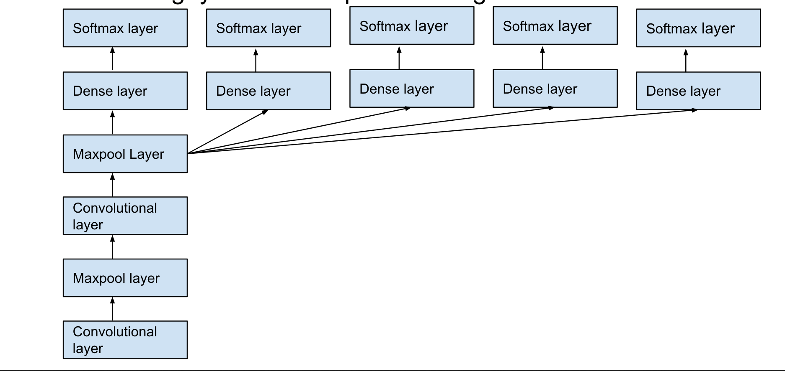

# CAPTCHA Solver

## Introduction
This project creates a couple of model architectures that given a CAPTCHA image, it predicts the three letters in the image. Note that the model architectures developed are trained and evaluated based on Google's old CAPTCHA system - where a user is asked to input characters seen given an image.

## How to run
After cloning and changing directories into this project, run the following command:
```python
python main.py
```

Currently, this will only train and evaluate the `CAPTCHACNNClassifier` model. Further additions such as using pre-trained weights and evaluating on the test set will be added in the near future.

## Project motivation
This project has been created because it tackles two key fields in deep learning: _computer vision_ and _natural language processing_. In computer vision, convolutional neural networks are the go-to architectures for various tasks such as object detection, image segmentation, etc. Meanwhile, recurrent neural networks proved to be helpful in creating language models and solving problems such as language translation.

I want to build two model architectures in order to solve this problem: **an end-to-end convolutional neural network** and **sequence-to-sequence network**.

Now, let's consider these architectures below.

## Model architectures

#### 1) End-to-end convolutional neural network
This end-to-end convolutional neural network has been inspired by [Garg](http://www.cs.sjsu.edu/faculty/pollett/masters/Semesters/Spring15/geetika/CS298%20Slides%20-%20PDF) for San José State University. It uses a combination of convolution and pooling layers to extract features from the image. Then, the key component in this architecture is to create `n` (i.e., the number of letters in the image) fully-connected layers. This is similar to older strategies of solving this problem by segmenting the image to a per-letter image and running it through the model. Finally, a softmax layer has been added to predict the three letters from the image.

Here's the model architecture taken from [Garg's presentation (slide 33)](http://www.cs.sjsu.edu/faculty/pollett/masters/Semesters/Spring15/geetika/CS298%20Slides%20-%20PDF):


#### 2) Sequence-to-sequence network
_This is in progress._

